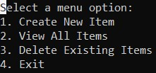

# Cafe Menu App - Gold Badge Challenge
To start running the application, be sure to set this project as the default start.
When running the app the user will be shown a menu that they may select 4 options.

The menu options will show up as seen here:

### Create New Item

### View All Items

### Delete Existing Items

### Exit
By selecting 4, you will exit this instance of the console.

---
[Back to home](../README.md)