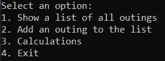
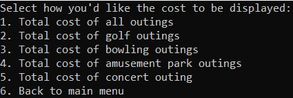

# Company Outing App - Gold Badge Challenge
To start running the application, be sure to set this project as the default start.
When running the app the user will be shown a menu that they may select 4 options.

The menu options will show up as seen here:

## Show a list of all outings
When the user selects "1" and presses "Enter" on the keyboard, they will be shown all company outings in a list form.

## Add an outing to the list
When the user selects "2" and presses "Enter" on the keyboard, they will be able to input information to add another company outing.

The fist user prompt is:
`Enter the name of the event:`

After filling in the name, the user will be promted to:

`Enter the number of attendees:`

This should be filled with numerals (no decimals).

The next information the user will be prompted to fill in is the date of the outing.

`Enter the date of the outing: yyyy-mm-dd`

The date must be entered in the yyyy-mm-dd format.

The user will then enter the cost per person.

`Enter the cost per person:`

This may be fulfilled by using a decimal (i.e. 6.75 or 100.20)

Next the user will enter the total cost.

`Enter the total cost:`

This again can be supplied with a decimal.

Finally, the user will be required to enter one number that corresponds with the event that they are entering.

`Enter the number that corresponds with the event (1 Golf, 2 Bowling, 3 Amusement Park, 4 Concert):`

After filling that out, the user will be asked if they would like to enter another event.

`Would you like to enter another event y for yes or n for no`

If the user selects y, the user will begin the process again.  If the user selects n, they will be taken back to the main menu.

## Calculations
When the user selects 3, the user will be shown a new menu (seen in the image below).

The user may select 1 to see the cost of all the outings or the user has the opportunity to see the total cost of a specific type of outing.

If the user wants to go back to the main menu, they select 6.

## Exit
By selecting 4, you will exit this instance of the console.

---
[Back to home](../README.md)