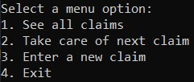

# Insurance Claims App - Gold Badge Challenge
To start running the application, be sure to set this project as the default start.
When running the app the user will be shown a menu that they may select 4 options.

## See all claims
By selecting number "1" and pressing "Enter" the user will be shown the list of claims.

After selecting any key, the user will be taken back to the main menu.

## Take care of next claim
By selecting number "2" and pressing "Enter" the user will be able to answer the following code:

`Enter Y for next Claim, N to return to menu`

Tapping Y and then "Enter" shows the next claim in the list.  Tapping N and then "Enter" returns the user to the menu.

## Enter a new claim
Tapping "3" and "Enter" invites the user to enter a new claim.  To successfully complete this, the user will enter information.

The first prompt says:
`Enter an ID Number for this claim`

The user will use numerals to complete this step.

The next step the user will complete is choosing the correct type of claim with the corresponding number.  The code looks like this:

`Enter the number that corresponds to the type of claim. (1. Car, 2. Home, 3.Theft)`

Note: Do not include the period after the number.

Next the user will" `Enter a description of the claim`

The user will then enter the claim amount.  Do not include a dollar sign.
`Enter the claim amount.`

Next, the user will enter the date of the incident in the yyyy-mm-dd format.

`Enter the date of the incident (yyyy-mm-dd)`

After that is completed, the user will enter the date the claim was made.

`Enter the date of the claim (yyyy-mm-dd)`

Finally, the user will answer a question:

`Is this claim within 30 days of the incident? type y for yes or n for no`

Note: if the user selects n, the claim will not be valid.

## Exit
By selecting 4, you will exit this instance of the console.

---
[Back to home](../README.md)